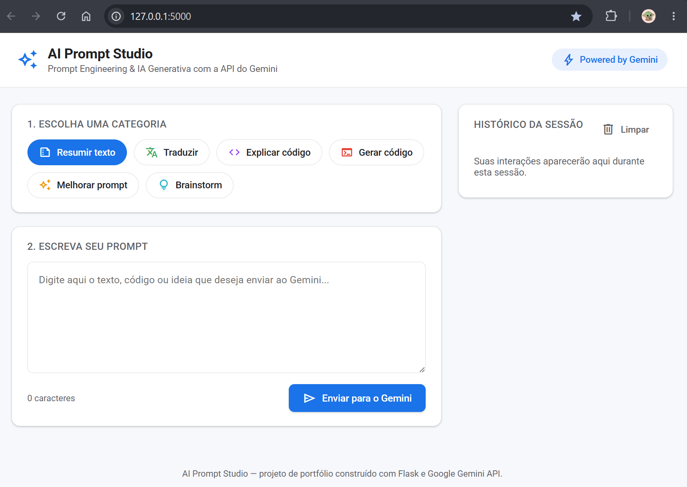

<div align="center">

# 🧠 AI Prompt Studio

[](https://www.python.org/)
[](https://flask.palletsprojects.com/)
[](https://ai.google.dev/)

Um laboratório de **Prompt Engineering** construído com **Flask** e a **API do Google Gemini**.


> ⚙️ O usuário escreve um prompt, escolhe uma categoria de tarefa (resumir, traduzir, explicar código, gerar código, melhorar prompt ou brainstorm) e recebe a resposta gerada pelo Gemini em tempo real, com todo o histórico da sessão visível na tela.

</div>

---

## Funcionalidades

- Envio de prompts em linguagem natural para a API do Gemini.
- Seis categorias de tarefa, cada uma com uma instrução de sistema própria:
  - 📝 **Resumir texto**
  - 🌐 **Traduzir**
  - 💻 **Explicar código**
  - ⚙️ **Gerar código**
  - ✨ **Melhorar prompt**
  - 💡 **Brainstorm**
- Visualização da resposta gerada, com opção de copiar para a área de transferência.
- Histórico de conversas da sessão atual (banco de dados).
- Interface responsiva, com identidade visual inspirada nos produtos do Google (Material Design, tipografia Roboto, cards e paleta clara).
- Tratamento de erros amigável (chave de API ausente, prompt vazio, falhas de comunicação com a API).

---

## Tecnologias utilizadas

| Camada         | Tecnologia                                    |
|----------------|-----------------------------------------------|
| Backend        | Python 3, Flask                               |
| Banco de Dados | SQLite                              |
| IA Generativa  | Google Gemini API (`google-genai` SDK)        |
| Frontend       | HTML5, CSS3, JavaScript                       |

---

## 📁 Estrutura do projeto

```
ai-prompt-studio/
│
├── app.py                     # Rotas Flask e orquestração da aplicação
├── config.py                  
├── requirements.txt           # Dependências do projeto
├── README.md
├── .env.example              
│
├── templates/
│   └── index.html             
│
├── static/
│   ├── style.css               
│   └── script.js              
│
└── services/
    ├── __init__.py
    └── gemini_service.py       # Integração com a API do Gemini
```

Essa separação segue o princípio de **responsabilidade única**: `app.py` cuida apenas de rotas HTTP, `gemini_service.py` cuida apenas da IA, e templates/static cuidam apenas da apresentação.

---

## ⚙️ Como instalar e executar

### Pré-requisitos

- Python 3.10 ou superior
- Uma chave de API do Google Gemini (veja a seção abaixo)

### Passo a passo

```bash
# 1. Clone o repositório
git clone https://github.com/seu-usuario/ai-prompt-studio.git
cd ai-prompt-studio

# 2. Crie e ative um ambiente virtual (recomendado)
python -m venv venv
source venv/bin/activate        # Linux/macOS
venv\Scripts\activate           # Windows

# 3. Instale as dependências
pip install -r requirements.txt

# 4. Configure as variáveis de ambiente
cp .env.example .env
# Edite o arquivo .env e insira sua GEMINI_API_KEY

# 5. Execute a aplicação
python app.py
```

A aplicação estará disponível em **http://localhost:5000**.

---

## 🔑 Como configurar a chave da Gemini API

1. Acesse o [Google AI Studio](https://aistudio.google.com/app/apikey).
2. Faça login com sua conta Google.
3. Clique em **"Create API key"** e copie a chave gerada.
4. Cole a chave no arquivo `.env` na raiz do projeto:

   ```
   GEMINI_API_KEY=sua_chave_copiada_aqui
   ```

5. (Opcional) Ajuste `GEMINI_MODEL` no `.env` para usar outro modelo disponível na sua conta. A lista atualizada de modelos pode ser consultada em [ai.google.dev/gemini-api/docs/models](https://ai.google.dev/gemini-api/docs/models).

Assim que a chave estiver configurada, o projeto funciona imediatamente — não é necessário nenhum outro serviço externo ou banco de dados.

---

## 📸 Ilustração



---

#