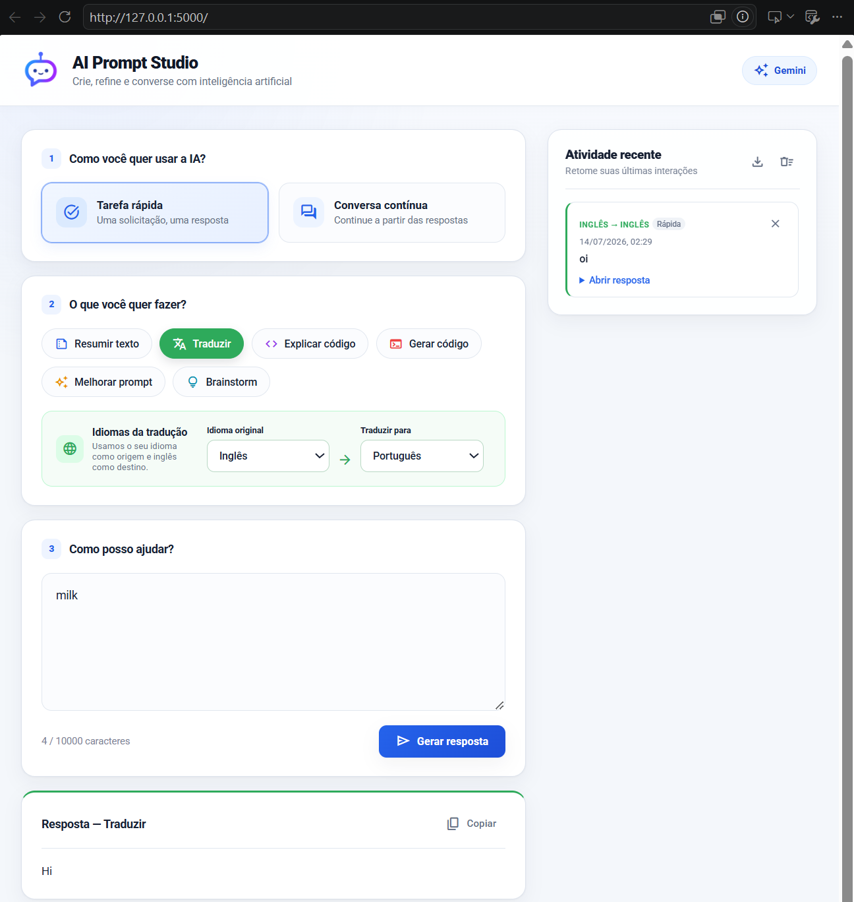

# AI Prompt Studio

[](https://www.python.org/)
[](https://flask.palletsprojects.com/)
[](https://ai.google.dev/)
[](https://developer.mozilla.org/docs/Web/HTML)
[](https://developer.mozilla.org/docs/Web/CSS)
[](https://developer.mozilla.org/docs/Web/JavaScript)

[English](README.md) · [Português (Brasil)](README.pt-BR.md)

Um ambiente web objetivo para tarefas comuns assistidas por IA, desenvolvido com o Google Gemini. A aplicação reúne fluxos especializados, conversas com contexto, controles de tradução e histórico local em uma estrutura Flask leve.

## Destaques

- Seis fluxos especializados: resumo, tradução, explicação de código, geração de código, melhoria de prompt e brainstorming.
- Tradução com o idioma do navegador como origem e inglês como destino padrão; ambos podem ser alterados.
- Modos de tarefa única e conversa com contexto.
- Histórico privado no navegador, com exclusão individual, limpeza completa e exportação em JSON.
- Markdown sanitizado, limites de requisição, validação de contexto e rate limiting por IP.
- Backend stateless: prompts e respostas não são armazenados pelo Flask.

## Tecnologias

Python 3.10+, Flask 3, Google Gen AI SDK, Mistune, Bleach e HTML, CSS e JavaScript sem framework.

## Instalação

### 1. Crie e ative um ambiente virtual

```powershell
python -m venv .venv
.venv\Scripts\activate
```

No Linux ou macOS:

```bash
python -m venv .venv
source .venv/bin/activate
```

### 2. Instale as dependências

```bash
python -m pip install -r requirements.txt
```

### 3. Configure o Gemini

Crie um arquivo `.env` na raiz do projeto:

```env
GEMINI_API_KEY=sua_chave_de_api
GEMINI_MODEL=gemini-3.5-flash
FLASK_DEBUG=False
```

### 4. Execute a aplicação

```bash
python app.py
```

Acesse [http://127.0.0.1:5000](http://127.0.0.1:5000).

## Testes

Os testes utilizam mocks e não consomem a API do Gemini.

```bash
python -m unittest discover -s tests -v
node --check static/script.js
```

## Privacidade e limites

O histórico permanece somente no navegador atual por meio do `localStorage`. No modo de conversa, as mensagens recentes são enviadas com a solicitação atual para preservar o contexto e descartadas pelo servidor em seguida.

Os limites de entrada, contexto, requisição, histórico e taxa podem ser ajustados por variáveis de ambiente definidas em [`config.py`](config.py). O rate limiter incluído é indicado para uma única instância da aplicação.

## Estrutura do projeto

```text
app.py                      Rotas Flask, validações, rate limiting e Markdown
config.py                   Configuração por variáveis de ambiente
services/gemini_service.py Integração com o Gemini e instruções especializadas
templates/index.html        Interface da aplicação
static/                     Comportamento no navegador e estilos responsivos
tests/                      Testes do backend e do contrato da IA
```

## Interface


